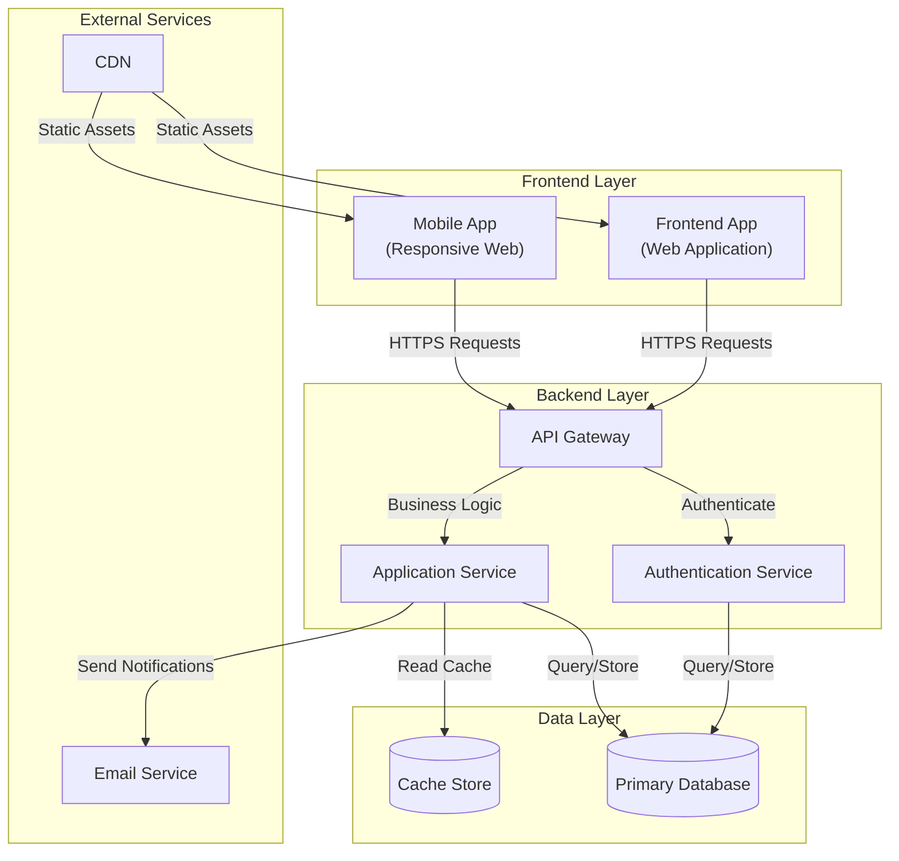
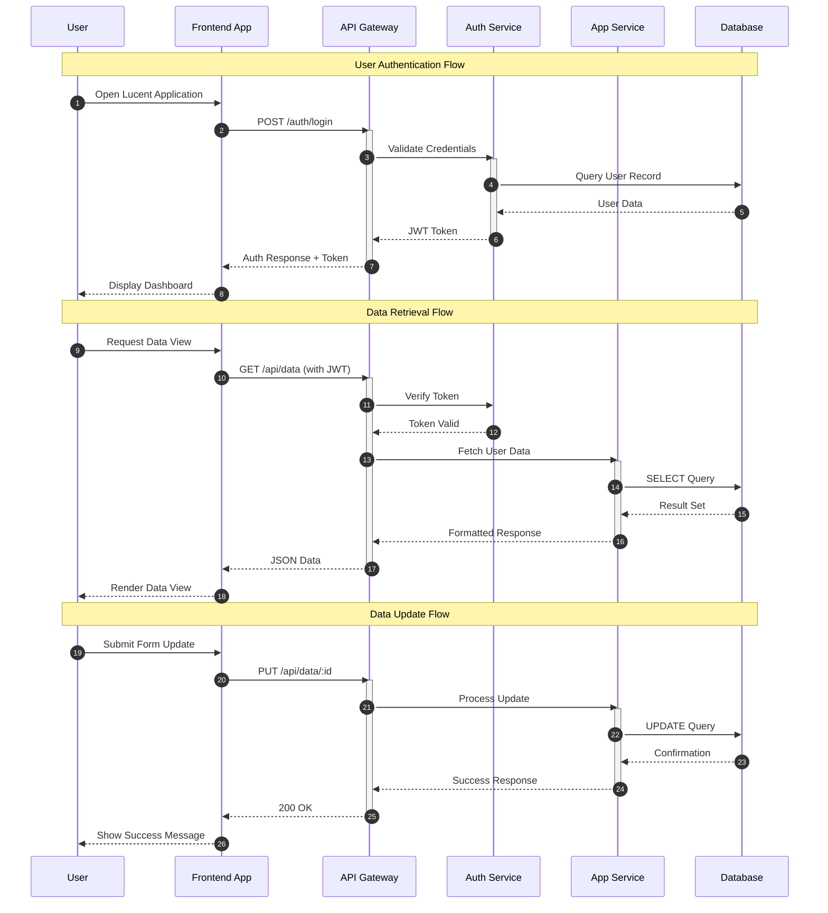
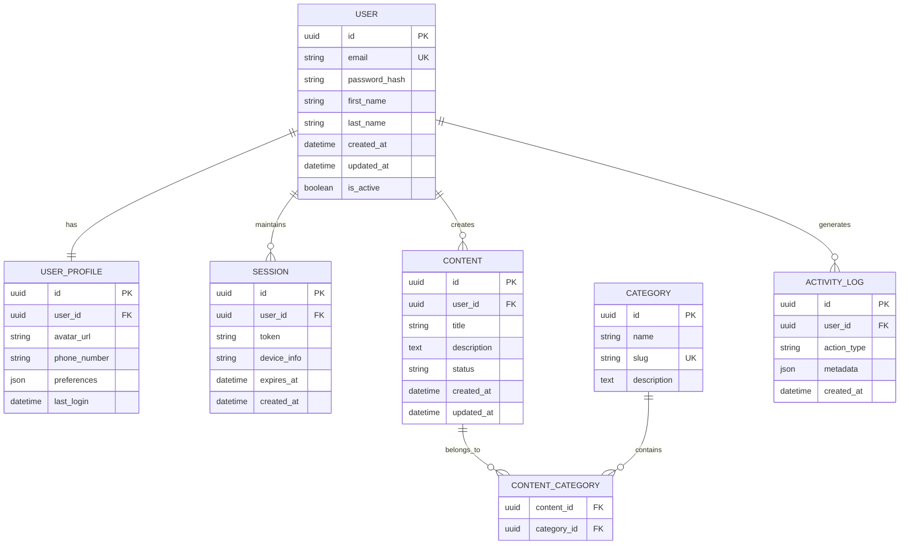
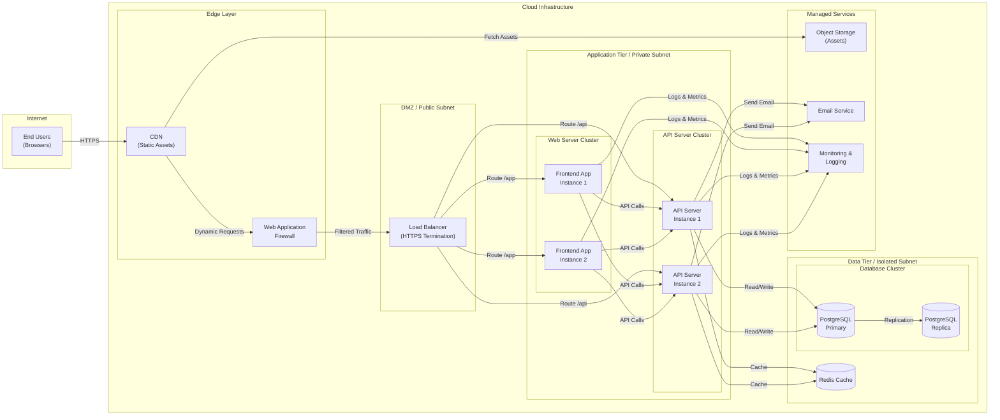

# System Architecture Document

## Project Overview
**Repository:** SmitVgithub/lucent
**Language:** unknown
**Request:** 1. End Consumers
2. Medium
3. $50-$70

Only web-based application support

## Architecture Diagram

### Request Flow

### Database Schema

### Deployment Architecture

## Architecture Narrative

1. End Consumers
2. Medium
3. $50-$70

Only web-based application support

## Components

- **Frontend App** (service): Frontend App for lucent
- **Mobile App** (service): Mobile App for lucent

---
*Generated by Blueprint Brain 1.7*
