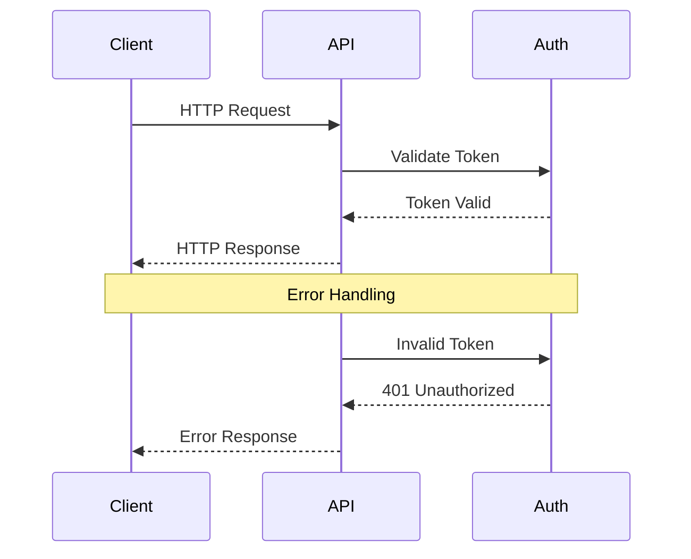
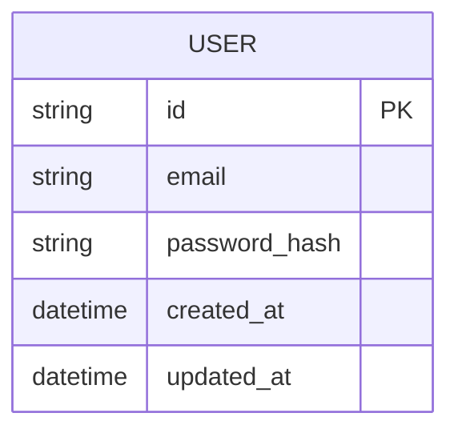
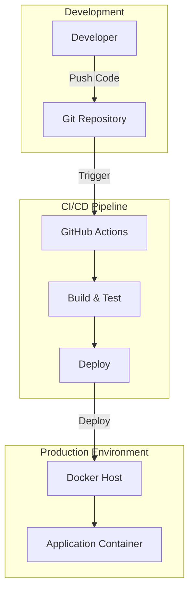

# System Architecture Document

## Project Overview
**Repository:** undefined
**Language:** unknown
**Request:** • What is your expected user volume? (hobby project, startup scale, enterprise scale) - startup scale
• Do you want to use a pre-built AI/ML API (like Remove.bg, Clipdrop) or build your own ML model for background removal? - want ml model
• What's your budget for cloud services and APIs? - $100 per month
• Do you need user authentication and saved history of processed images? - yes
• What's your preferred tech stack? (React/Vue/Angular for frontend, Node.js/Python/Go for backend) - React for frontend and python for backend
• Do you need batch processing (multiple images at once)? - yes
• What's the maximum image size/resolution you need to support? - 5 MB max 
• Do you need real-time preview or is async processing acceptable? - may be yes
• Will this be a free service, freemium, or paid subscription model? - free + paid 
• Do you have any existing infrastructure or cloud provider preference (AWS, GCP, Azure, Vercel)? - vercel

## Executive Summary
Lucent is a startup-scale AI background removal platform using a hybrid architecture optimized for a $100/month budget. The frontend is a React SPA deployed on Vercel's edge network, while ML inference runs on Modal.com's serverless GPUs using the U2-Net model. Supabase provides authentication, PostgreSQL database, and object storage as a unified backend. The freemium model is enforced through Upstash Redis rate limiting, with Stripe handling subscriptions. The architecture supports batch processing, near-real-time preview for small images, and async processing with WebSocket updates for larger files. Key design decisions prioritize cost efficiency while maintaining good user experience and scalability for growth.

## System Architecture

### Architecture Diagram

graph TB
    subgraph Client["Client Layer"]
        WEB["React SPA\n(Vercel Edge)"]
        MOBILE["Future: Mobile App"]
    end

    subgraph Edge["Edge/CDN Layer"]
        VERCEL_EDGE["Vercel Edge Network\n(Global CDN)"]
        VERCEL_FUNC["Vercel Serverless\nFunctions (Node.js)"]
    end

    subgraph API["API Gateway Layer"]
        AUTH["Auth Service\n(Supabase Auth)"]
        RATE["Rate Limiter\n(Upstash Redis)"]
        ORCHESTRATOR["Job Orchestrator\n(Python FastAPI)"]
    end

    subgraph Processing["ML Processing Layer"]
        QUEUE["Job Queue\n(Upstash Redis)"]
        GPU_WORKER["GPU Workers\n(Modal.com)"]
        ML_MODEL["U2-Net / RMBG\nModel"]
    end

    subgraph Data["Data Layer"]
        DB[("PostgreSQL\n(Supabase)")]
        STORAGE[("Object Storage\n(Supabase Storage)")]
        CACHE[("Redis Cache\n(Upstash)")]
    end

    subgraph External["External Services"]
        STRIPE["Stripe\n(Payments)"]
        RESEND["Resend\n(Email)"]
    end

    WEB -->|HTTPS| VERCEL_EDGE
    MOBILE -.->|Future| VERCEL_EDGE
    VERCEL_EDGE --> VERCEL_FUNC
    
    VERCEL_FUNC --> AUTH
    VERCEL_FUNC --> RATE
    VERCEL_FUNC --> ORCHESTRATOR
    
    AUTH --> DB
    RATE --> CACHE
    
    ORCHESTRATOR -->|"Submit Job"| QUEUE
    ORCHESTRATOR -->|"Upload Original"| STORAGE
    ORCHESTRATOR <-->|"WebSocket Updates"| WEB
    
    QUEUE --> GPU_WORKER
    GPU_WORKER --> ML_MODEL
    GPU_WORKER -->|"Save Result"| STORAGE
    GPU_WORKER -->|"Update Status"| DB
    GPU_WORKER -->|"Notify Complete"| CACHE
    
    VERCEL_FUNC --> STRIPE
    VERCEL_FUNC --> RESEND
    
    STORAGE -->|"Signed URLs"| WEB

### Request Flow Diagram

### Database Schema

### Deployment Architecture

### High-Level Design
## Architectural Analysis for Lucent - AI Background Removal Platform

### Design Philosophy
This architecture is designed for a startup-scale AI-powered background removal service with a freemium model. The key challenge is balancing cost efficiency ($100/month budget) with the need for ML model inference, which is computationally expensive. I've designed a hybrid architecture that leverages Vercel for the frontend and API layer while using a cost-effective GPU cloud provider for ML inference.

### Core Design Decisions

**1. ML Model Selection: U2-Net over Custom Training**
I recommend using U2-Net (U-Square Net) or RMBG-1.4 (RemBG) - both are open-source, production-ready models for salient object detection and background removal. Training a custom model would exceed your budget significantly and take months. U2-Net provides excellent results and can run on modest GPU hardware.

**2. Hybrid Deployment Strategy**
Vercel excels at frontend hosting and serverless functions but lacks GPU support for ML inference. The architecture uses:
- **Vercel**: React frontend + API routes for auth, payments, and orchestration
- **Modal.com or RunPod**: Serverless GPU inference ($0.0002/second for T4 GPU) - fits perfectly within $100/month for startup scale
- **Supabase**: PostgreSQL database + Auth + Storage (generous free tier)

**3. Async Processing with Real-time Feel**
For images under 2MB, we provide near-real-time processing (<3 seconds). For larger images and batch processing, we use a queue-based system with WebSocket updates. This hybrid approach optimizes cost while maintaining good UX.

**4. Freemium Model Implementation**
Free tier: 10 images/day, max 2MB, watermarked output
Paid tier: Unlimited images, 5MB max, no watermark, batch processing, API access
This is enforced at the API layer with rate limiting and feature flags.

### Trade-offs Considered

**Alternative 1: AWS Lambda + EFS for ML**
Rejected because Lambda cold starts with ML models are 15-30 seconds, and EFS adds complexity and cost.

**Alternative 2: Self-hosted GPU Server**
Rejected because a dedicated GPU server costs $150-300/month minimum, exceeding budget. Serverless GPU is more cost-effective for variable workloads.

**Alternative 3: Pre-built API (Remove.bg)**
Rejected per user requirement, but worth noting Remove.bg costs $0.20/image which would limit you to 500 images/month on your budget.

### Scalability Considerations
The architecture scales horizontally at each layer:
- Vercel auto-scales frontend and API
- Modal/RunPod auto-scales GPU workers
- Supabase handles connection pooling
- Redis (Upstash) provides distributed rate limiting

### Cost Breakdown (Estimated Monthly)
- Vercel Pro: $20 (needed for commercial use)
- Modal.com GPU: $40-60 (estimated 50,000 images/month)
- Supabase: $0-25 (free tier likely sufficient initially)
- Upstash Redis: $0-10 (free tier for rate limiting)
- Total: $60-115/month

This fits your budget while allowing room for growth.

### Component Breakdown
## Component Breakdown

### 1. React Frontend (Vercel)
**Responsibilities:**
- Image upload with drag-and-drop, paste from clipboard
- Real-time preview using canvas manipulation
- Progress tracking via WebSocket connection
- User dashboard for history and subscription management
- Batch upload interface with queue visualization

**Key Libraries:** React 18, TanStack Query, Zustand, React-Dropzone, Socket.io-client

### 2. Vercel Serverless Functions
**Responsibilities:**
- API routing and request validation
- Authentication middleware (JWT verification)
- Rate limiting enforcement
- Stripe webhook handling
- Presigned URL generation for direct uploads

### 3. FastAPI Orchestrator (Modal.com)
**Responsibilities:**
- Job queue management and prioritization
- Image preprocessing (resize, format conversion)
- Coordination between storage and GPU workers
- WebSocket server for real-time updates
- Batch job splitting and aggregation

### 4. GPU Workers (Modal.com)
**Responsibilities:**
- Load and cache ML model in GPU memory
- Process images through U2-Net/RMBG model
- Post-processing (edge refinement, alpha matting)
- Output format conversion (PNG with transparency)
- Watermark application for free tier

### 5. Supabase Backend
**Responsibilities:**
- User authentication (email, Google, GitHub OAuth)
- PostgreSQL database for user data, job history, subscriptions
- Object storage for original and processed images
- Row-level security for data isolation
- Real-time subscriptions for job status

### 6. Upstash Redis
**Responsibilities:**
- Distributed rate limiting with sliding window
- Job queue with priority levels (paid users first)
- Session caching for faster auth
- Pub/sub for real-time notifications

### Technology Stack
## Technology Stack

### Frontend
| Technology | Version | Justification |
|------------|---------|---------------|
| React | 18.x | User preference, excellent ecosystem |
| TypeScript | 5.x | Type safety, better DX |
| Vite | 5.x | Fast builds, excellent HMR |
| TailwindCSS | 3.x | Rapid UI development |
| TanStack Query | 5.x | Server state management, caching |
| Zustand | 4.x | Lightweight client state |
| Socket.io-client | 4.x | Real-time updates |
| React-Dropzone | 14.x | File upload handling |

### Backend
| Technology | Version | Justification |
|------------|---------|---------------|
| Python | 3.11 | ML ecosystem, user preference |
| FastAPI | 0.109.x | Async support, auto OpenAPI docs |
| Pydantic | 2.x | Data validation |
| Pillow | 10.x | Image manipulation |
| PyTorch | 2.x | ML model inference |
| U2-Net/RMBG | Latest | Background removal model |

### Infrastructure
| Service | Tier | Justification |
|---------|------|---------------|
| Vercel | Pro ($20/mo) | Frontend + API, global CDN |
| Modal.com | Pay-per-use | Serverless GPU, auto-scaling |
| Supabase | Free/Pro | Auth + DB + Storage bundle |
| Upstash | Free/Pay-per-use | Serverless Redis |
| Stripe | Pay-per-use | Payment processing |
| Resend | Free tier | Transactional emails |

## Implementation Phases

## Implementation Phases

### Phase 1: Foundation (Week 1-2)
**Tasks:**
- [ ] Initialize React project with Vite + TypeScript
- [ ] Set up Supabase project (auth, database schema, storage buckets)
- [ ] Create basic authentication flow (signup, login, OAuth)
- [ ] Design and implement database schema
- [ ] Set up Vercel project with environment variables

**Deliverables:** Working auth flow, database ready

### Phase 2: ML Pipeline (Week 3-4)
**Tasks:**
- [ ] Set up Modal.com account and GPU worker
- [ ] Implement U2-Net model loading and inference
- [ ] Create image preprocessing pipeline
- [ ] Implement post-processing (edge refinement)
- [ ] Build job queue with Upstash Redis
- [ ] Create FastAPI orchestrator endpoints

**Deliverables:** Working ML inference pipeline

### Phase 3: Core Features (Week 5-6)
**Tasks:**
- [ ] Build image upload component with preview
- [ ] Implement WebSocket connection for real-time updates
- [ ] Create processing status UI
- [ ] Build result display with download options
- [ ] Implement image history dashboard
- [ ] Add batch upload functionality

**Deliverables:** Functional image processing flow

### Phase 4: Monetization (Week 7-8)
**Tasks:**
- [ ] Integrate Stripe for subscriptions
- [ ] Implement rate limiting per tier
- [ ] Add watermarking for free tier
- [ ] Build subscription management UI
- [ ] Create usage tracking and analytics
- [ ] Set up transactional emails with Resend

**Deliverables:** Complete freemium system

### Phase 5: Polish & Launch (Week 9-10)
**Tasks:**
- [ ] Performance optimization
- [ ] Error handling and retry logic
- [ ] Monitoring and alerting setup
- [ ] Documentation and API docs
- [ ] Security audit
- [ ] Beta testing and feedback

**Deliverables:** Production-ready application

## Risk Analysis

## Risk Analysis

### High Risk

**1. GPU Cost Overrun**
- *Risk:* Viral growth could exceed $100/month budget quickly
- *Probability:* Medium
- *Impact:* High (service interruption)
- *Mitigation:* 
  - Implement hard spending limits in Modal.com
  - Aggressive rate limiting for free tier
  - Queue throttling when approaching budget
  - Alert at 50%, 75%, 90% of budget

**2. ML Model Quality Issues**
- *Risk:* U2-Net may not handle all image types well (hair, transparent objects)
- *Probability:* Medium
- *Impact:* Medium (user dissatisfaction)
- *Mitigation:*
  - Offer manual refinement tools
  - A/B test multiple models (RMBG-1.4 as backup)
  - Collect user feedback for edge cases

### Medium Risk

**3. Cold Start Latency**
- *Risk:* GPU workers may have 10-30 second cold starts
- *Probability:* High
- *Impact:* Medium (poor UX)
- *Mitigation:*
  - Keep minimum 1 warm worker during peak hours
  - Show engaging loading animation
  - Implement predictive warming based on traffic patterns

**4. Vercel Function Timeout**
- *Risk:* 10-second timeout on Vercel functions may not be enough
- *Probability:* Medium
- *Impact:* Medium
- *Mitigation:*
  - Use async processing pattern
  - Return job ID immediately, poll for results
  - WebSocket for real-time updates

### Low Risk

**5. Supabase Storage Limits**
- *Risk:* Free tier has 1GB storage limit
- *Probability:* Low (initially)
- *Impact:* Low (easy to upgrade)
- *Mitigation:*
  - Implement image expiration (delete after 7 days for free users)
  - Upgrade to Pro when needed ($25/month)

**6. Security Vulnerabilities**
- *Risk:* Image upload could be exploited
- *Probability:* Low
- *Impact:* High
- *Mitigation:*
  - Validate file types server-side
  - Scan for malicious content
  - Use signed URLs with expiration
  - Implement CORS properly

## Dependencies
- **SUPABASE_URL**: Supabase project URL
- **SUPABASE_ANON_KEY**: Supabase anonymous/public key for client
- **SUPABASE_SERVICE_KEY**: Supabase service role key for server
- **MODAL_TOKEN_ID**: Modal.com authentication token ID
- **MODAL_TOKEN_SECRET**: Modal.com authentication token secret
- **UPSTASH_REDIS_URL**: Upstash Redis connection URL
- **UPSTASH_REDIS_TOKEN**: Upstash Redis authentication token
- **STRIPE_SECRET_KEY**: Stripe API secret key
- **STRIPE_WEBHOOK_SECRET**: Stripe webhook signing secret
- **STRIPE_PRICE_ID_MONTHLY**: Stripe price ID for monthly subscription
- **STRIPE_PRICE_ID_YEARLY**: Stripe price ID for yearly subscription
- **RESEND_API_KEY**: Resend email service API key
- **NEXT_PUBLIC_APP_URL**: Public application URL for callbacks

## Interactive Visualization
For an interactive view of this architecture, open **ARCHITECTURE_PREVIEW.html** in your browser.

## Next Steps
1. Review this architecture document
2. Open ARCHITECTURE_PREVIEW.html for interactive diagrams
3. Validate technical decisions
4. Use AutoX brain to implement the architecture
5. Deploy to staging environment
6. Run integration tests
7. Deploy to production

---
*Generated by Blueprint Brain - The Architect*
*Date: 2026-05-16T10:13:32.451Z*
