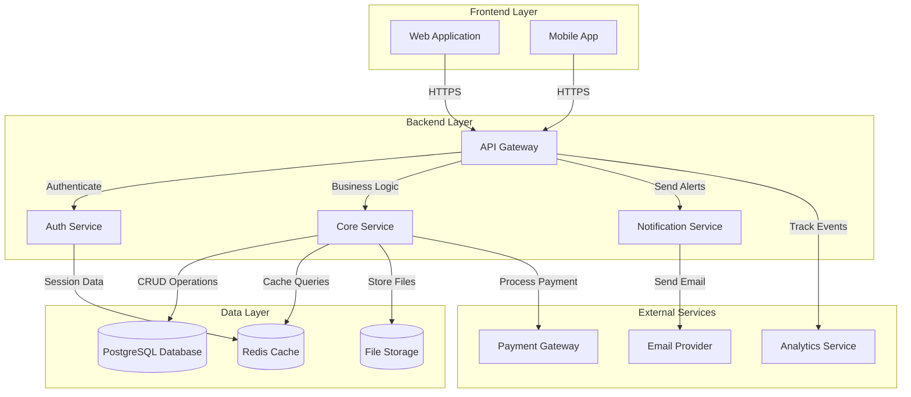
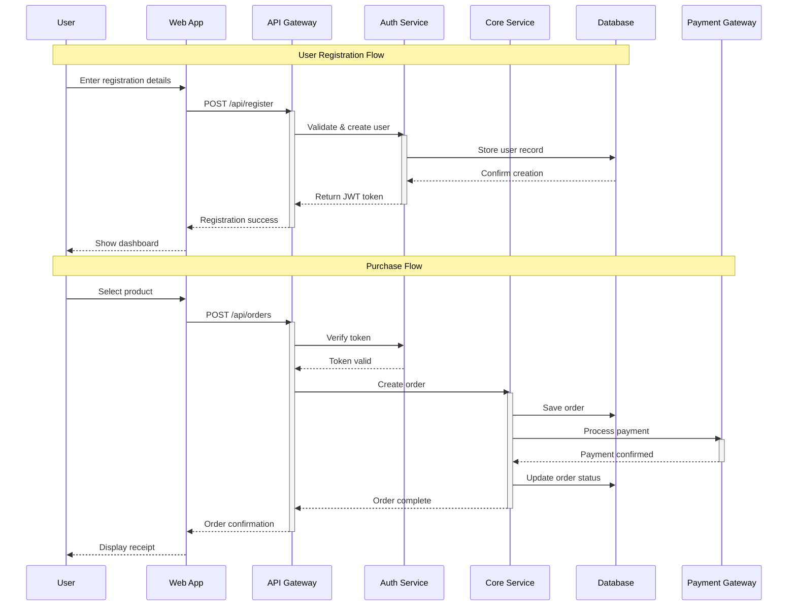
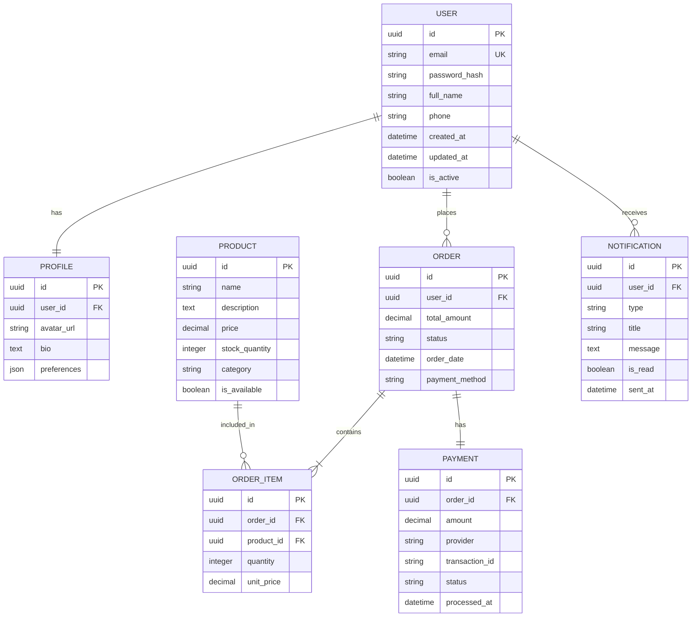
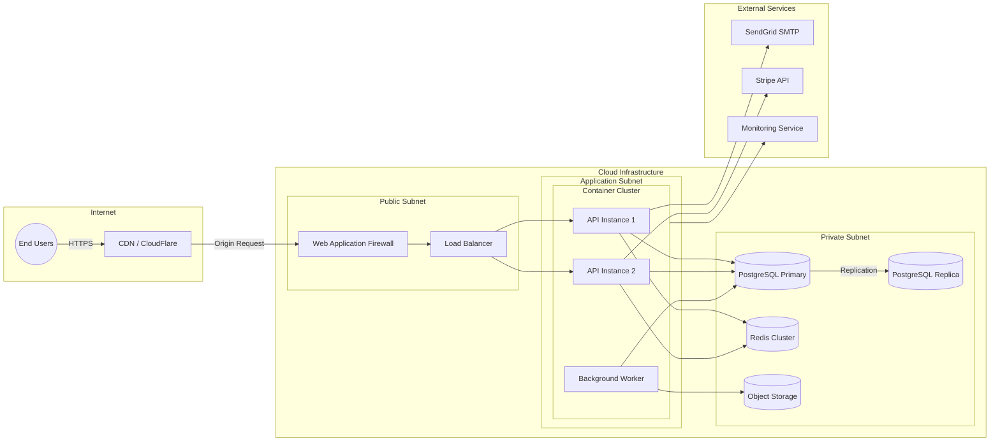

# System Architecture Document

## Project Overview
**Repository:** SmitVgithub/lucent
**Language:** unknown
**Request:** 1. End Consumers
2. Medium
3. Under $1000/month

## Architecture Diagram

### Request Flow

### Database Schema

### Deployment Architecture

## Architecture Narrative

1. End Consumers
2. Medium
3. Under $1000/month

---
*Generated by Blueprint Brain 1.7*
