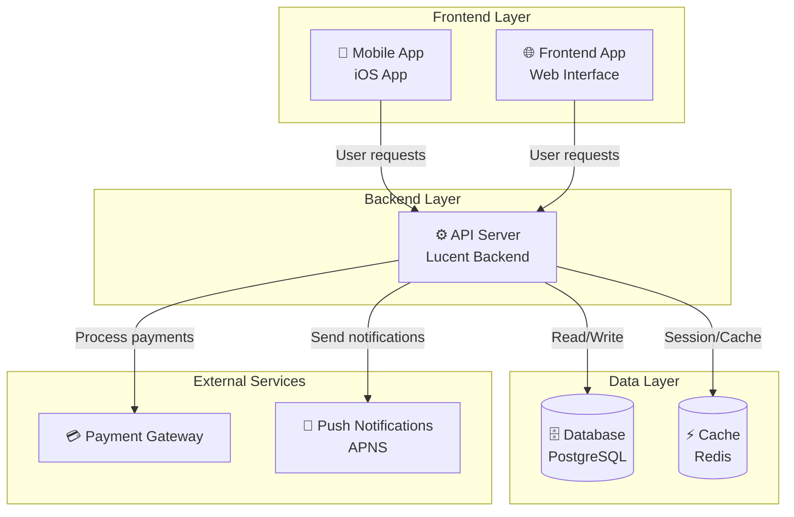
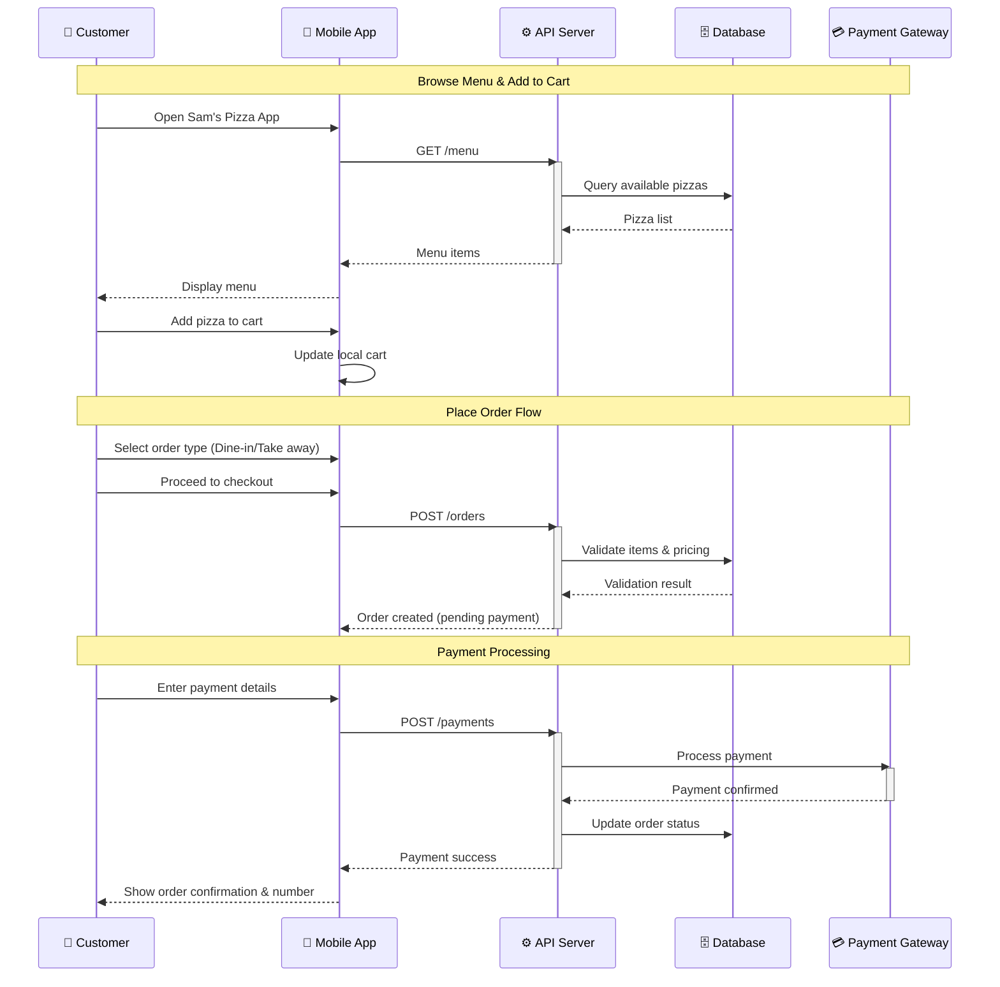
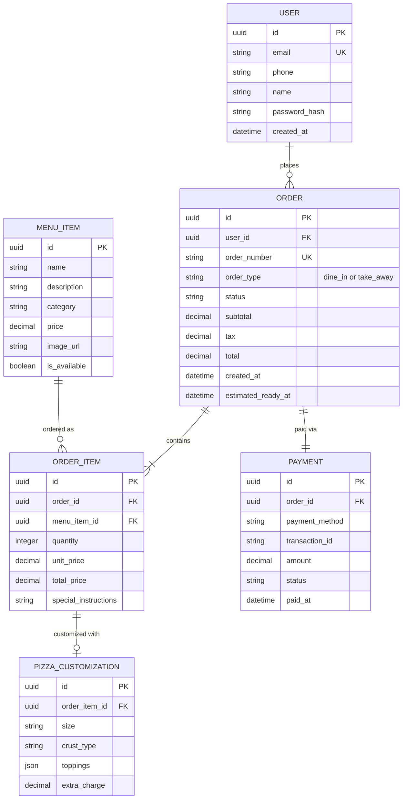
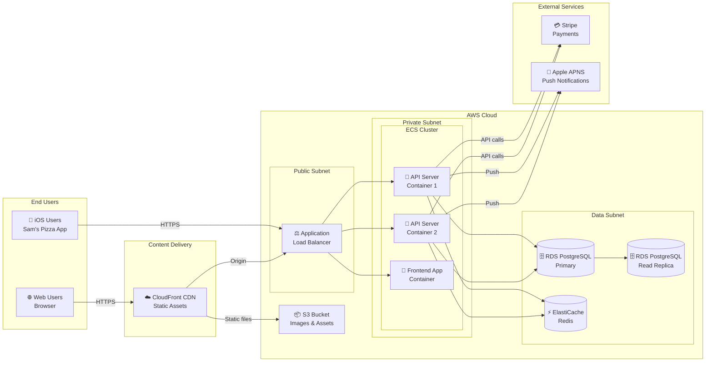

# System Architecture Document

## Project Overview
**Repository:** SmitVgithub/lucent
**Language:** unknown
**Request:** Build one online pizza restaurant application named "Sam's Pizza" where people can order the pizza on restaurant itself or take away - no home delivery. So there is only two option in restaurant and take away. It is for iOS app. Let me know if you need more information from my side.

## Architecture Diagram

### Request Flow

### Database Schema

### Deployment Architecture

## Architecture Narrative

Build one online pizza restaurant application named "Sam's Pizza" where people can order the pizza on restaurant itself or take away - no home delivery. So there is only two option in restaurant and take away. It is for iOS app. Let me know if you need more information from my side.

## Components

- **API Server** (service): API Server for lucent
- **Frontend App** (service): Frontend App for lucent
- **Mobile App** (service): Mobile App for lucent

---
*Generated by Blueprint Brain 1.7*
