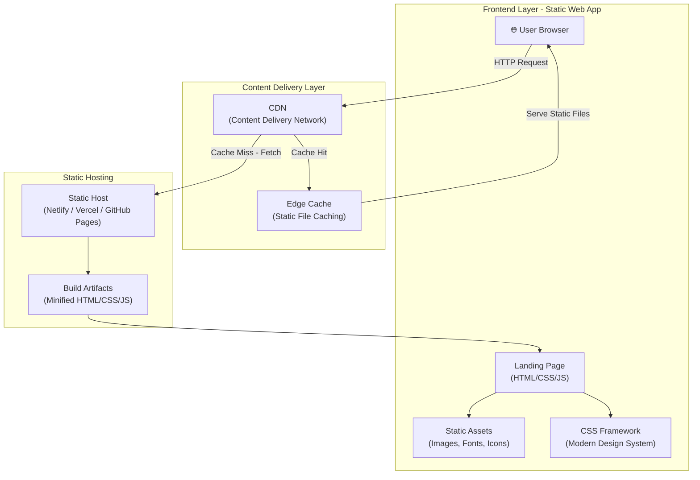
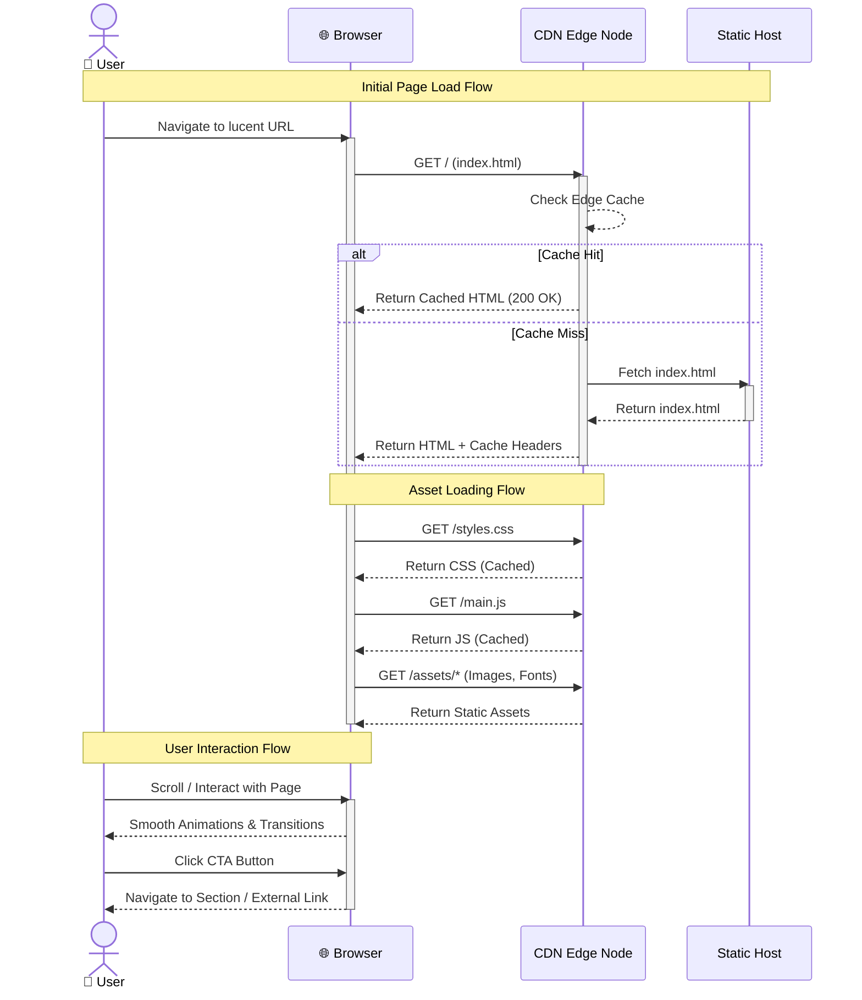
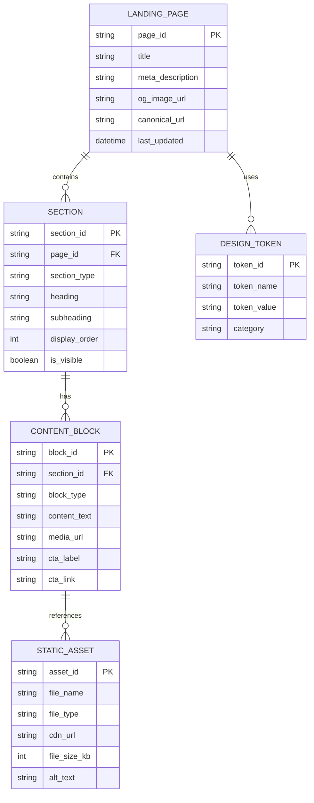
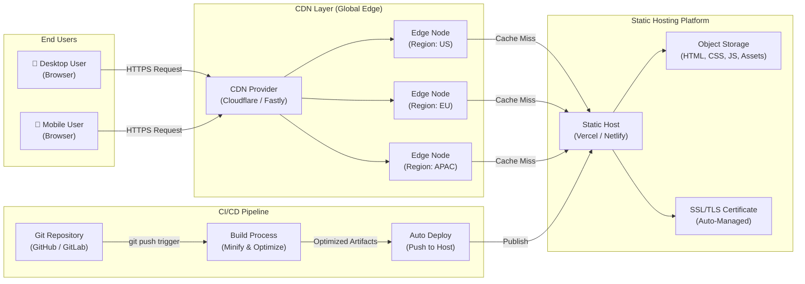

# System Architecture Document

## Project Overview
**Repository:** SmitVgithub/lucent
**Language:** unknown
**Request:** 1. Web aoo
2. Single landing page
3. Fresh modern  design 
4. pure static

## Architecture Diagram

### Request Flow

### Database Schema

### Deployment Architecture

## Architecture Narrative

1. Web aoo
2. Single landing page
3. Fresh modern  design 
4. pure static

---
*Generated by Blueprint Brain 1.7*
