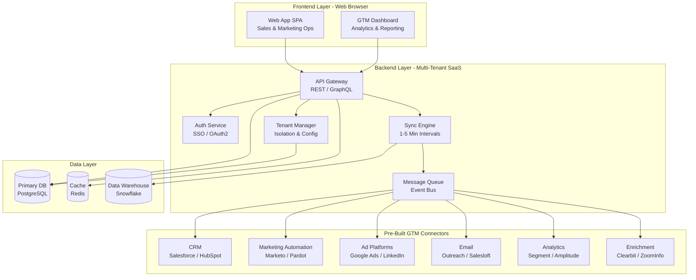
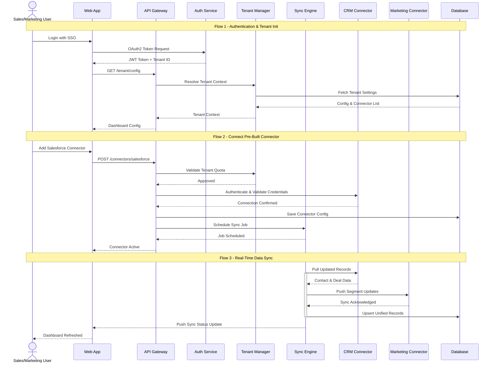
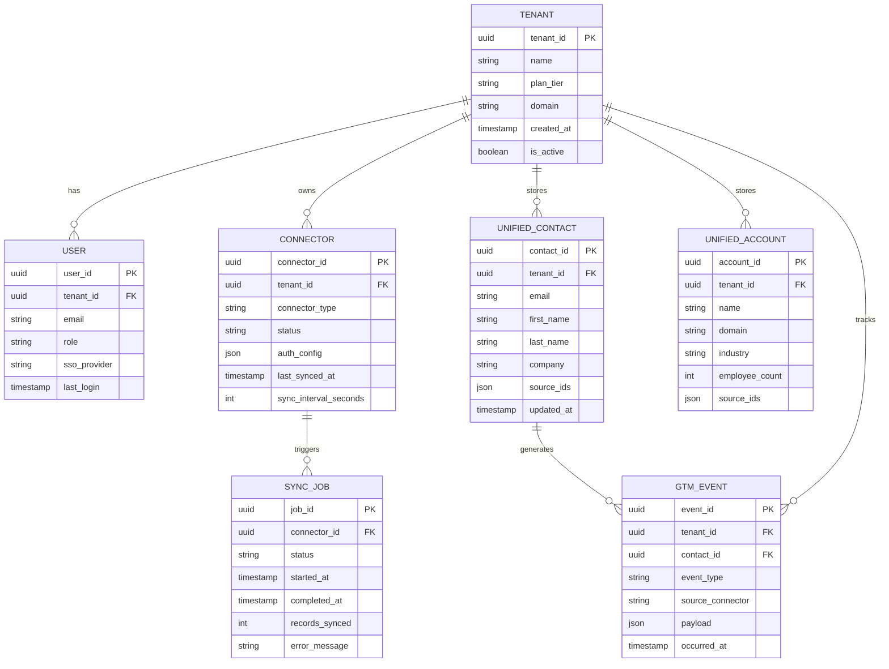
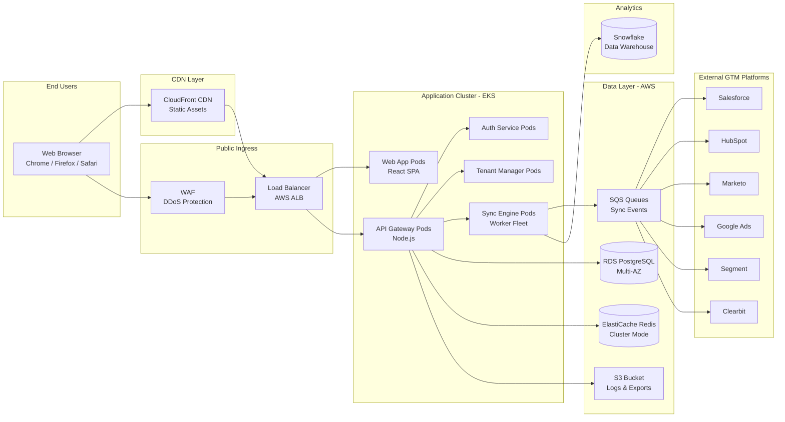

# System Architecture Document

## Project Overview
**Repository:** SmitVgithub/lucent
**Language:** unknown
**Request:** Answer: 
1. This is purely based on the web-based for sales and marketing ops.
2. All of the above - full GTM stack coverage
3. Sync data across connectors within 1-5 mintues
4. Multi-tenant SaaS
5. Pre-built connectors only.

## Architecture Diagram

### Request Flow

### Database Schema

### Deployment Architecture

## Architecture Narrative

Answer: 
1. This is purely based on the web-based for sales and marketing ops.
2. All of the above - full GTM stack coverage
3. Sync data across connectors within 1-5 mintues
4. Multi-tenant SaaS
5. Pre-built connectors only.

---
*Generated by Blueprint Brain 1.7*
