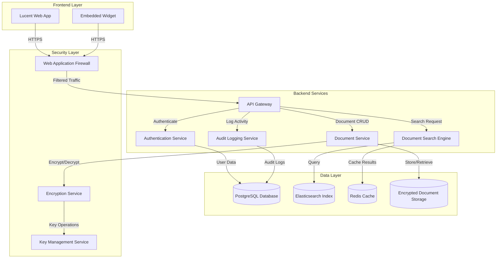
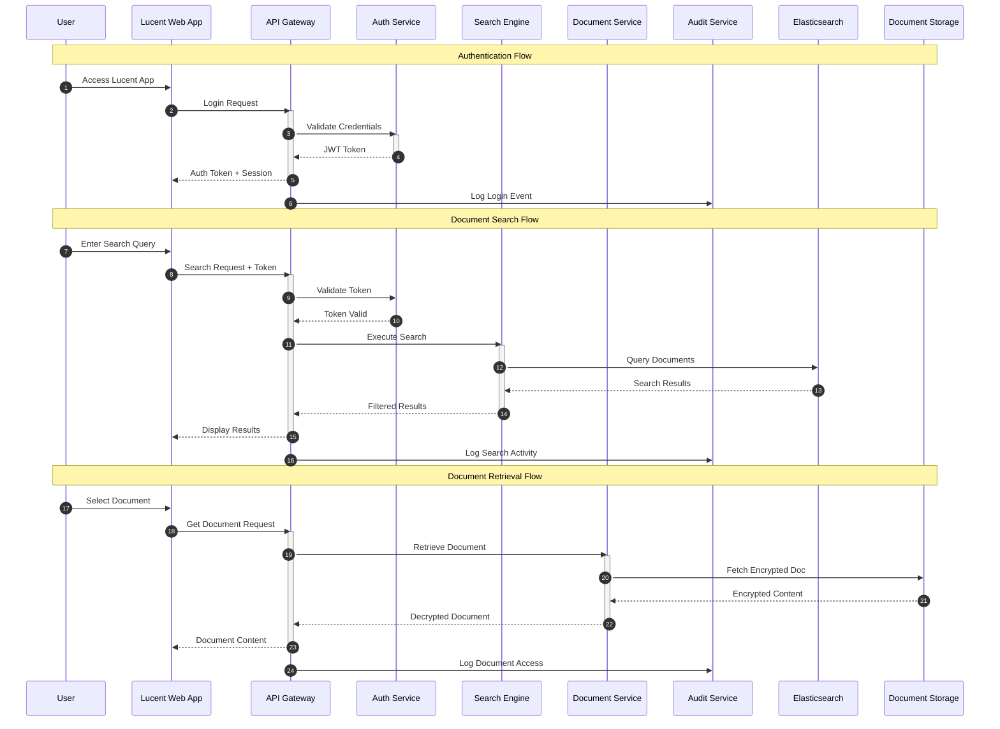
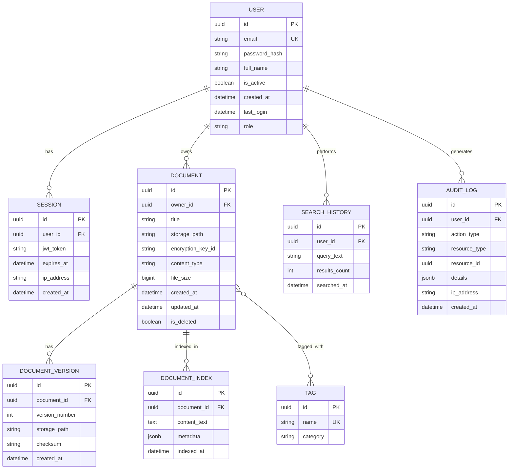
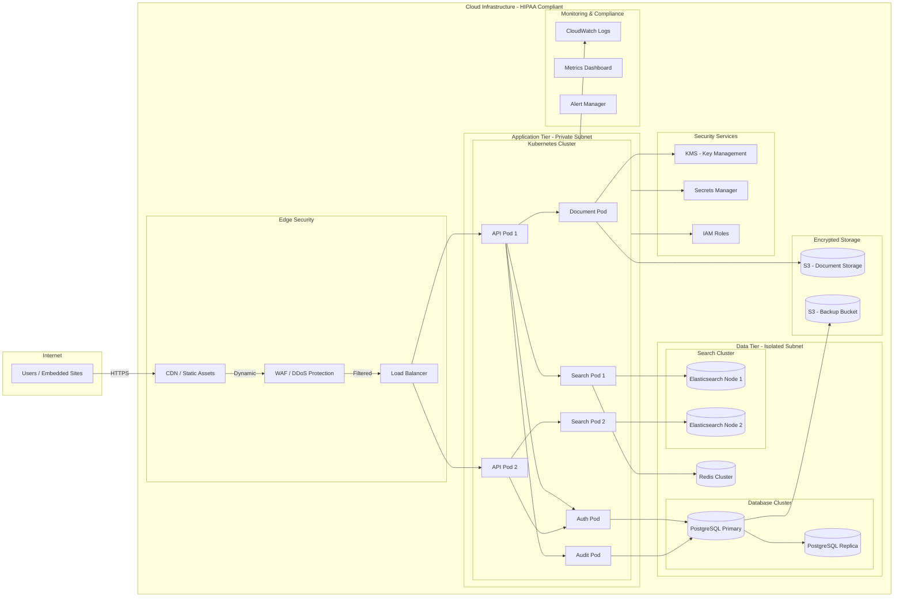

# System Architecture Document

## Project Overview
**Repository:** SmitVgithub/lucent
**Language:** unknown
**Request:** 1. Web app (embedded on my website)
2. Dynamic document search
3. HIPAA and ISO 27001
4. Standalone

## Architecture Diagram

### Request Flow

### Database Schema

### Deployment Architecture

## Architecture Narrative

# Blueprint Architecture Narrative: HIPAA-Compliant Document Search Platform

## Executive Summary

This architecture defines a standalone, embeddable web application for dynamic document search that meets stringent HIPAA and ISO 27001 compliance requirements. The system is designed to be embedded within an existing website while maintaining complete isolation of protected health information (PHI) and audit capabilities. By leveraging Google Cloud Platform's compliance-certified infrastructure combined with a carefully selected open-source stack, this design achieves the critical balance between regulatory compliance, operational simplicity, and cost-effectiveness for a greenfield deployment.

---

## System Overview and Design Philosophy

The architecture follows a **compliance-first, defense-in-depth** approach where every component interaction assumes potential exposure to PHI and implements appropriate safeguards. The frontend is a React Single Page Application built with TypeScript, embedded via iframe with strict Content Security Policy headers to prevent data leakage to the parent website. This isolation boundary is critical—the embedded app operates as a fully independent security domain, communicating only through well-defined postMessage APIs for non-sensitive UI coordination while all PHI-bearing requests flow directly to the backend over TLS 1.3.

The backend leverages **Node.js with Fastify**, chosen specifically for its low-overhead request handling and first-class TypeScript support, which enables compile-time type safety across the entire request/response lifecycle—a significant advantage when handling structured medical documents where schema violations could indicate injection attempts. Fastify's plugin architecture allows us to implement HIPAA-required audit logging as middleware that captures every PHI access event before the request handler executes, ensuring no code path can bypass compliance logging. The framework's built-in JSON Schema valida

---
*Generated by Blueprint Brain 1.7*
