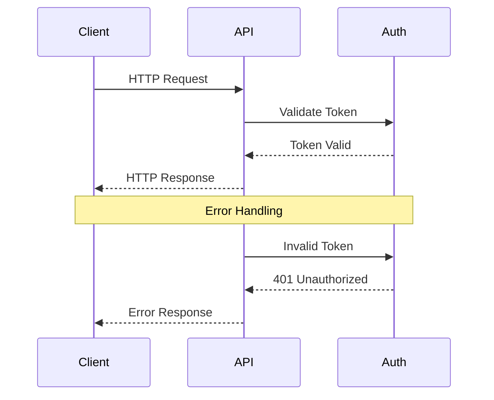
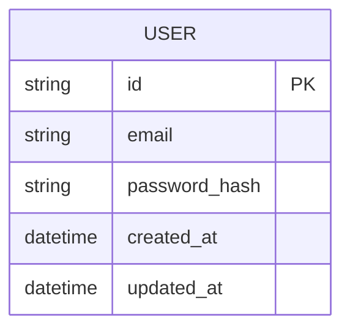
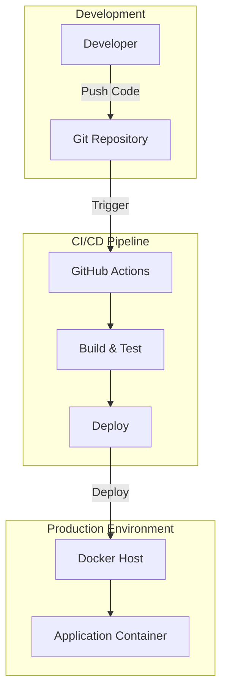

# System Architecture Document

## Project Overview
**Repository:** undefined
**Language:** unknown
**Request:** I want to create e background remover website.

• What is your expected user volume? (hobby project, startup scale, enterprise scale) - startup scale
• Do you want to use a pre-built AI/ML API (like Remove.bg, Clipdrop) or build your own ML model for background removal? - want ml model
• What's your budget for cloud services and APIs? - $100 per month
• Do you need user authentication and saved history of processed images? - yes
• What's your preferred tech stack? (React/Vue/Angular for frontend, Node.js/Python/Go for backend) - React for frontend and python for backend
• Do you need batch processing (multiple images at once)? - yes
• What's the maximum image size/resolution you need to support? - 5 MB max 
• Do you need real-time preview or is async processing acceptable? - may be yes
• Will this be a free service, freemium, or paid subscription model? - free + paid 
• Do you have any existing infrastructure or cloud provider preference (AWS, GCP, Azure, Vercel)? - vercel

## Executive Summary
This architecture delivers a production-ready background remover service optimized for startup scale within a $100/month budget. The system uses a hybrid deployment model: React frontend on Vercel (free), Python ML backend on a cost-effective VPS ($24/month), with Supabase handling auth and database ($25/month). The ML pipeline leverages the open-source rembg library (U2-Net model) running on CPU, processing images asynchronously via Celery workers. Real-time progress updates flow through WebSocket connections backed by Redis pub/sub. Cloudflare R2 provides zero-egress image storage with global CDN delivery. The freemium model is enforced through Stripe subscriptions with usage-based rate limiting. This architecture supports ~1000 images/day initially and scales horizontally by adding Celery workers or upgrading to GPU instances.

## System Architecture

### Architecture Diagram

graph TB
    subgraph Client["Client Layer"]
        WEB["React SPA\n(Vercel)"]
        MOBILE["Future Mobile App"]
    end

    subgraph CDN["Edge Layer"]
        CF["Cloudflare CDN"]
        R2["Cloudflare R2\nImage Storage"]
    end

    subgraph API["API Gateway Layer"]
        NGINX["Nginx\nReverse Proxy"]
        FASTAPI["FastAPI\nREST + WebSocket"]
    end

    subgraph Auth["Authentication"]
        SUPA_AUTH["Supabase Auth\nJWT + OAuth"]
    end

    subgraph Processing["ML Processing Layer"]
        CELERY["Celery Workers\n(x2-4 instances)"]
        REMBG["rembg Model\n(U2-Net)"]
        PREVIEW["Preview Generator\n(Pillow)"]
    end

    subgraph Queue["Message Queue"]
        REDIS["Redis\nTask Queue + Cache"]
    end

    subgraph Data["Data Layer"]
        POSTGRES[("PostgreSQL\n(Supabase)")]
        subgraph Tables["Database Schema"]
            USERS["users"]
            IMAGES["images"]
            SUBS["subscriptions"]
            USAGE["usage_logs"]
        end
    end

    subgraph Payments["Payment Processing"]
        STRIPE["Stripe\nSubscriptions"]
    end

    subgraph Monitoring["Observability"]
        SENTRY["Sentry\nError Tracking"]
        LOGS["Axiom/Logtail\nLog Aggregation"]
    end

    WEB -->|HTTPS| CF
    MOBILE -->|HTTPS| CF
    CF -->|Proxy| NGINX
    CF -->|Static Assets| R2
    
    NGINX -->|/api/*| FASTAPI
    NGINX -->|/ws/*| FASTAPI
    
    FASTAPI -->|Verify JWT| SUPA_AUTH
    FASTAPI -->|Queue Task| REDIS
    FASTAPI -->|CRUD| POSTGRES
    FASTAPI -->|Upload| R2
    
    REDIS -->|Consume| CELERY
    CELERY -->|Process| REMBG
    CELERY -->|Thumbnail| PREVIEW
    CELERY -->|Store Result| R2
    CELERY -->|Update Status| POSTGRES
    CELERY -->|Notify| REDIS
    
    REDIS -->|Pub/Sub| FASTAPI
    FASTAPI -->|WebSocket Push| WEB
    
    WEB -->|Checkout| STRIPE
    STRIPE -->|Webhook| FASTAPI
    FASTAPI -->|Update Plan| POSTGRES
    
    FASTAPI -->|Errors| SENTRY
    CELERY -->|Errors| SENTRY
    NGINX -->|Access Logs| LOGS

### Request Flow Diagram

### Database Schema

### Deployment Architecture

### High-Level Design
This architecture is designed for a startup-scale background remover service with a freemium model, optimizing for the $100/month budget constraint while maintaining scalability. The core design decision centers around using **rembg** (based on U2-Net) as the ML model - it's open-source, runs efficiently on CPU, and produces professional-quality results without expensive GPU infrastructure.

**Why This Architecture:**

1. **Hybrid Deployment Strategy**: The frontend deploys to Vercel (free tier) while the ML backend runs on a dedicated VPS. This separation is crucial because Vercel's serverless functions have a 10-second timeout and 50MB payload limit - incompatible with ML inference. A $20-40/month VPS (Hetzner/DigitalOcean) with 4GB RAM handles the ML workload efficiently.

2. **Redis Queue for Batch Processing**: Instead of synchronous processing, images are queued in Redis and processed by Celery workers. This enables batch uploads, prevents timeout issues, and allows horizontal scaling by adding workers. Users get immediate feedback while processing happens asynchronously.

3. **Supabase as Backend-as-a-Service**: At startup scale, managing PostgreSQL, authentication, and storage separately would consume budget and engineering time. Supabase's free tier provides PostgreSQL (500MB), Auth, and 1GB storage - perfect for MVP. The paid tier ($25/month) scales to 8GB database and 100GB storage.

4. **Cloudflare R2 for Image Storage**: Unlike S3, R2 has zero egress fees - critical for an image-heavy service. The free tier includes 10GB storage and 10 million reads/month. Processed images are served via Cloudflare CDN for fast global delivery.

5. **Real-time Preview via WebSocket**: For premium users, we implement a WebSocket connection that streams processing progress. The preview uses a lightweight thumbnail (max 512px) for instant feedback, while full resolution processes in background.

**Trade-offs Considered:**

- **Self-hosted ML vs API (Remove.bg)**: Remove.bg costs $0.20/image at scale. With 500 images/day, that's $3,000/month - far exceeding budget. Self-hosted rembg has zero per-image cost.

- **Vercel Edge Functions vs Dedicated Backend**: Edge functions would simplify deployment but can't run PyTorch models. The hybrid approach adds complexity but is necessary for ML workloads.

- **PostgreSQL vs MongoDB**: Structured user data, subscriptions, and image metadata fit relational models better. Supabase's PostgreSQL also provides Row Level Security for multi-tenant data isolation.

**Scalability Path:**

At current design, the system handles ~1000 images/day on a single 4GB VPS. Scaling involves: (1) Adding Celery workers horizontally, (2) Upgrading to GPU instances for 10x throughput, (3) Implementing CDN caching for repeated requests. The architecture supports this growth without redesign.

**Budget Allocation ($100/month):**
- VPS (4GB RAM): $24/month (Hetzner CPX21)
- Supabase Pro: $25/month
- Cloudflare R2: ~$5/month (estimated)
- Redis Cloud: Free tier (30MB)
- Vercel: Free tier
- Domain + misc: ~$10/month
- **Buffer**: ~$36/month for traffic spikes

### Component Breakdown
**Frontend (React + TypeScript)**
- **Upload Component**: Drag-drop zone with client-side validation (5MB limit, image types). Uses react-dropzone with preview thumbnails.
- **Processing Dashboard**: Real-time status updates via WebSocket. Shows queue position, progress percentage, and estimated time.
- **Image Editor**: Post-processing tools - download in PNG/JPG/WebP, resize options, background replacement with solid colors or custom images.
- **User Dashboard**: History of processed images, usage statistics, subscription management.
- **Auth Flow**: Supabase Auth UI components for login/signup with Google, GitHub OAuth.

**Backend (FastAPI + Python)**
- **Auth Middleware**: Validates Supabase JWT tokens, extracts user context, enforces rate limits based on subscription tier.
- **Upload Endpoint**: Accepts multipart/form-data, validates file size/type, generates unique ID, uploads to R2, queues processing task.
- **WebSocket Manager**: Maintains connections per user, subscribes to Redis pub/sub for task updates, pushes real-time progress.
- **Batch Processor**: Accepts ZIP files or multiple images, creates batch job with progress tracking per image.
- **Webhook Handler**: Receives Stripe events (subscription created/updated/cancelled), updates user subscription status.

**ML Processing (Celery + rembg)**
- **Task Worker**: Pulls jobs from Redis queue, downloads image from R2, runs rembg inference, uploads result to R2.
- **Preview Generator**: Creates 512px thumbnail for real-time preview before full processing completes.
- **Quality Optimizer**: Post-processes output - removes artifacts, smooths edges, optimizes file size.
- **Batch Handler**: Processes multiple images sequentially, publishes progress after each completion.

**Data Models**
- **users**: id, email, created_at, subscription_tier, stripe_customer_id
- **images**: id, user_id, original_url, processed_url, status, created_at, file_size, processing_time
- **subscriptions**: id, user_id, stripe_subscription_id, plan, status, current_period_end
- **usage_logs**: id, user_id, action, credits_used, timestamp

### Technology Stack
**Frontend:**
- **React 18** + TypeScript: Industry standard, excellent ecosystem, Vercel-optimized
- **Vite**: Fast builds, HMR, better DX than CRA
- **TailwindCSS**: Rapid UI development, small bundle size
- **React Query (TanStack)**: Server state management, caching, optimistic updates
- **Zustand**: Lightweight client state (auth, UI state)
- **react-dropzone**: Battle-tested file upload handling

**Backend:**
- **FastAPI**: Async Python framework, automatic OpenAPI docs, WebSocket support, type hints
- **Celery**: Distributed task queue, retry logic, task chaining for batch processing
- **rembg**: Open-source background removal using U2-Net, CPU-efficient, production-ready
- **Pillow**: Image manipulation for thumbnails, format conversion, optimization
- **python-multipart**: Multipart form handling for file uploads
- **httpx**: Async HTTP client for external API calls

**Infrastructure:**
- **Supabase**: PostgreSQL + Auth + Realtime subscriptions, generous free tier
- **Redis (Upstash/Redis Cloud)**: Task queue, caching, pub/sub for WebSocket
- **Cloudflare R2**: S3-compatible storage, zero egress fees, global CDN
- **Vercel**: Frontend hosting, edge functions for lightweight API routes
- **Hetzner/DigitalOcean VPS**: Cost-effective ML backend hosting

**DevOps:**
- **Docker**: Containerized backend for consistent deployments
- **GitHub Actions**: CI/CD pipeline, automated testing, deployment
- **Nginx**: Reverse proxy, SSL termination, rate limiting
- **Sentry**: Error tracking and performance monitoring

**Payments:**
- **Stripe**: Subscription management, usage-based billing, webhooks

## Implementation Phases

**Phase 1: Foundation (Week 1-2)**
- [ ] Initialize React project with Vite, TypeScript, TailwindCSS
- [ ] Set up FastAPI project structure with proper layering (routes, services, models)
- [ ] Configure Supabase project - database schema, auth providers
- [ ] Implement basic auth flow (signup, login, logout)
- [ ] Create Docker configuration for backend
- [ ] Set up GitHub repository with branch protection

**Phase 2: Core ML Pipeline (Week 3-4)**
- [ ] Integrate rembg library, test with sample images
- [ ] Set up Celery with Redis backend
- [ ] Implement image upload endpoint with R2 storage
- [ ] Create processing task with status updates
- [ ] Build basic frontend upload UI
- [ ] Implement image history/gallery view

**Phase 3: Real-time Features (Week 5)**
- [ ] Add WebSocket endpoint for progress updates
- [ ] Implement Redis pub/sub for task notifications
- [ ] Create preview generation (thumbnail processing)
- [ ] Build real-time progress UI component
- [ ] Add batch upload support (multiple files)

**Phase 4: Monetization (Week 6)**
- [ ] Integrate Stripe - products, prices, checkout
- [ ] Implement webhook handler for subscription events
- [ ] Create subscription tiers (Free: 10/day, Pro: 100/day, Business: unlimited)
- [ ] Add usage tracking and rate limiting
- [ ] Build subscription management UI

**Phase 5: Polish & Launch (Week 7-8)**
- [ ] Implement download options (PNG, JPG, WebP)
- [ ] Add background replacement feature
- [ ] Set up Sentry error tracking
- [ ] Configure Nginx with SSL (Let's Encrypt)
- [ ] Performance optimization (lazy loading, caching)
- [ ] Write API documentation
- [ ] Deploy to production
- [ ] Set up monitoring dashboards

## Risk Analysis

**High Risk:**

1. **ML Model Performance on CPU**
   - *Risk*: rembg on CPU may be too slow for real-time preview (5-15 seconds per image)
   - *Mitigation*: Implement aggressive thumbnail preview (512px max), show progress bar, consider GPU upgrade path (Hetzner GPU servers at $50/month)
   - *Fallback*: Use Remove.bg API for premium tier if self-hosted can't meet SLA

2. **Budget Overrun from Traffic Spikes**
   - *Risk*: Viral moment could exceed $100/month budget
   - *Mitigation*: Implement hard rate limits, queue depth limits, auto-scaling alerts. Use Cloudflare's free DDoS protection.
   - *Fallback*: Temporary service degradation (longer queue times) vs. overage charges

**Medium Risk:**

3. **Supabase Vendor Lock-in**
   - *Risk*: Pricing changes or service issues
   - *Mitigation*: Use standard PostgreSQL features, abstract auth behind interface. Migration path to self-hosted Supabase or raw PostgreSQL exists.

4. **Image Quality Edge Cases**
   - *Risk*: Complex backgrounds, hair, transparent objects may produce poor results
   - *Mitigation*: Set user expectations, provide manual touch-up tools, collect feedback for model fine-tuning

5. **WebSocket Scaling**
   - *Risk*: Many concurrent WebSocket connections strain single server
   - *Mitigation*: Use Redis pub/sub for horizontal scaling, implement connection pooling, add sticky sessions if needed

**Low Risk:**

6. **Stripe Integration Complexity**
   - *Risk*: Webhook handling, subscription edge cases
   - *Mitigation*: Use Stripe's official Python library, implement idempotency, comprehensive webhook logging

7. **CORS/Security Issues**
   - *Risk*: Cross-origin requests, file upload vulnerabilities
   - *Mitigation*: Strict CORS policy, file type validation, virus scanning for uploads, signed URLs for downloads

## Dependencies
- **SUPABASE_URL**: Supabase project URL for database and auth
- **SUPABASE_ANON_KEY**: Supabase anonymous/public key for client-side auth
- **SUPABASE_SERVICE_KEY**: Supabase service role key for backend operations
- **CLOUDFLARE_R2_ACCESS_KEY**: R2 storage access key ID
- **CLOUDFLARE_R2_SECRET_KEY**: R2 storage secret access key
- **CLOUDFLARE_R2_BUCKET**: R2 bucket name for image storage
- **CLOUDFLARE_R2_ENDPOINT**: R2 S3-compatible endpoint URL
- **REDIS_URL**: Redis connection string for Celery and caching
- **STRIPE_SECRET_KEY**: Stripe API secret key for server-side operations
- **STRIPE_WEBHOOK_SECRET**: Stripe webhook signing secret for verification
- **STRIPE_PRICE_PRO**: Stripe Price ID for Pro subscription tier
- **STRIPE_PRICE_BUSINESS**: Stripe Price ID for Business subscription tier
- **SENTRY_DSN**: Sentry Data Source Name for error tracking
- **JWT_SECRET**: Secret key for JWT token signing (if not using Supabase JWT)

## Interactive Visualization
For an interactive view of this architecture, open **ARCHITECTURE_PREVIEW.html** in your browser.

## Next Steps
1. Review this architecture document
2. Open ARCHITECTURE_PREVIEW.html for interactive diagrams
3. Validate technical decisions
4. Use AutoX brain to implement the architecture
5. Deploy to staging environment
6. Run integration tests
7. Deploy to production

---
*Generated by Blueprint Brain - The Architect*
*Date: 2026-05-16T12:00:44.743Z*
