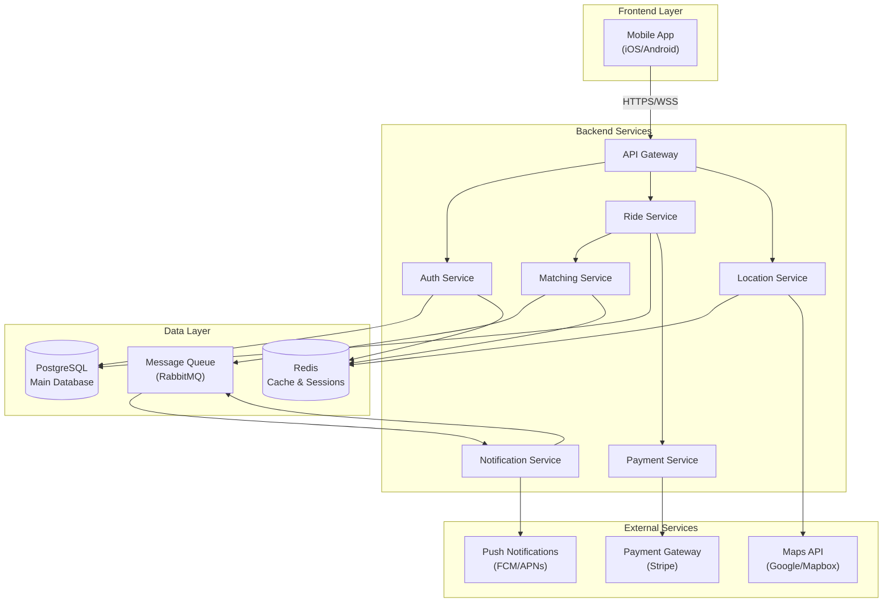
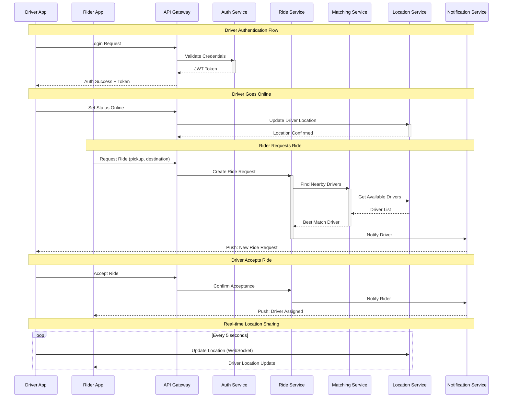
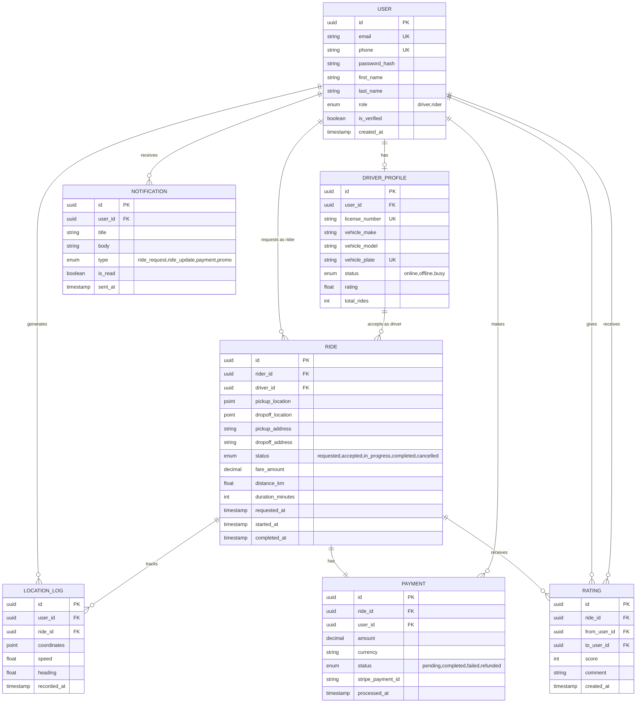
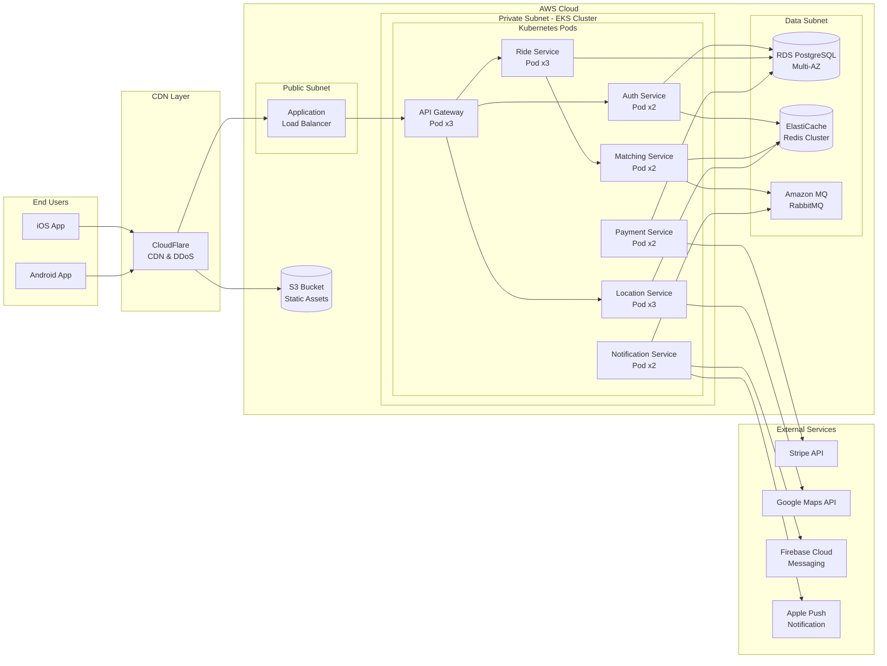

# System Architecture Document

## Project Overview
**Repository:** SmitVgithub/lucent
**Language:** unknown
**Request:** Create a taxi driver application with a real-time ride sharing.

## Architecture Diagram

### Request Flow

### Database Schema

### Deployment Architecture

## Architecture Narrative

Create a taxi driver application with a real-time ride sharing.

## Components

- **Mobile App** (service): Mobile App for lucent

---
*Generated by Blueprint Brain 1.7*
